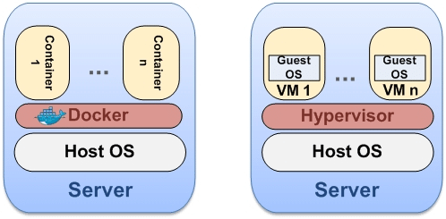

Cloud Computing Theory
==

## A. What is the difference between container based virtualization and hypervisor based virtualization?

In a nutshell, hypervisors abstract away hardware and enable you to run operating systems; whereas containers (technically container engines) abstract away operating systems and enable you to run applications.

There're 2 types of hypervisors:
* type 1 is a lightweight operating system(hypervisor) is installed on a physical computer or server (bare-metal). Examples: KVM, ECXi
* type 2 a.k.a "hosted hypervisors", installed on top of a standard operating system. Examples: VirtualBox, VMWare Player

A simplified comparison is (container vs type 2 hypervisor)

